#  Information Architecture

BEFORE: 

View the original site structure in Lucidchart:
[Original information architecture](https://maddie35.s3.us-east-2.amazonaws.com/IA.png)](https://lucid.app/lucidspark/9ef4a81d-e959-4ea1-84f5-07c52e70c498/edit?viewport_loc=-6343%2C-3130%2C18622%2C9180%2C0_0&invitationId=inv_fd9ed048-7a12-474f-bd44-9796082aa03c)

```mermaid
flowchart TD
    A[Affirm]

    A --> B[Intro to Affirm]
    A --> C[Getting Started]
    A --> D[Developer Reference]
    A --> E[Affirm Integration Options]
    A --> F[Payment Service Provider Integrations]
    A --> G[eCommerce Platform Integrations]
    A --> H[Business Hub]

    B --> B1[Understanding Affirm]
    B --> B2[Planning Your Integration]

    B1 --> B11[How Affirm Works]
    B1 --> B12[Solutions We Offer]
    B1 --> B13[Platforms We Support]
    B1 --> B14[Digital Wallets]
    B14 --> B141[Amazon Pay]
    B14 --> B142[Apple Pay]
    B14 --> B143[Google Pay]
    B1 --> B15[Multiple Financing Programs]
    B1 --> B16[Partners]
    B16 --> B161[Affirm Partners]
    B16 --> B162[Platform Metadata]

    B2 --> B21[Planning Considerations]
    B2 --> B22[Billing & Shipping Addresses]
    B2 --> B23[Performance]
    B2 --> B24[Supported Web Browsers]
    B2 --> B25[Merchant Security]
    B25 --> B251[Secure Communications]
    B25 --> B252[Security Best Practices]
    B2 --> B26[Identity Fraud with Travel Signals]
    B2 --> B27[Additional Integration Requirements]
    B2 --> B28[Partner Test & Go-Live]

    C --> C1[Quickstart]
    C --> C2[Checkout]

    C1 --> C11[Quickstart Guide]
    C1 --> C12[Developer Tools and Resources]

    C2 --> C21[Open Affirm Checkout]
    C2 --> C22[Open Affirm Virtual Card Checkout]
    C2 --> C23[Modal vs Redirect vs Direct Checkout]

    D --> D1[Affirm.js Reference]
    D --> D2[API Reference]
    D --> D3[Recipes]
    D --> D4[Analytics]
    D --> D5[Webhooks]

    D2 --> D21[Intro]
    D2 --> D22[Merchant Transaction API]
    D2 --> D23[Cards API]

    D3 --> D31[Inline Integration]

    D4 --> D41[Confirmation Page Analytics]

    D5 --> D51[Best Practices]
    D5 --> D52[Verify & Validate Webhook Signatures]
    D5 --> D53[Manage...]

    E --> E1[Direct API]
    E --> E2[Affirm Lite]
    E --> E3[Affirm Landing Page]
    E --> E4[Mobile SDKs]
    E --> E5[In-Store]
    E --> E6[Telesales]
    E --> E7[Virtual Card]

    E1 --> E11[About Direct API]
    E1 --> E12[Set Up Direct API]
    E1 --> E13[About Split Capture]

    E2 --> E21[About Affirm Lite]
    E2 --> E22[Set Up Affirm Lite]

    E3 --> E31[About Affirm Landing Page]
    E3 --> E32[Set Up Affirm Landing Page]

    E4 --> E41[About Mobile SDKs]
    E4 --> E42[Set Up Android SDK]
    E4 --> E43[Set Up iOS SDK]

    E5 --> E51[About In-Store]
    E5 --> E52[Set Up In-Store]

    E6 --> E61[About Telesales]
    E6 --> E62[Set Up Telesales]

    E7 --> E71[About Virtual Card]
    E7 --> E72[Set Up Virtual Card]

    F --> F1[Payment Service Platforms]
    F1 --> F11[Adyen]
    F1 --> F12[APEXX]
    F1 --> F13[See All]

    G --> G1[eCommerce Platforms]
    G1 --> G11[Acacda]
    G1 --> G12[See All]

    H --> H1[Business Hub Home]
    H --> H2[Getting Paid]
    H --> H3[Using the Merchant Portal]
    H --> H4[Settlements and Payments]
    H --> H5[Dispute Resolutions]
    H --> H6[Compliance & Guidelines]
```

NOW: 

BONUS: 

With the templatized content providing a consistent experience for both users and computers, we implemented an AI tool to further improve the documentation experience. [View it in action](https://maddie35.s3.us-east-2.amazonaws.com/AI-assistant.mp4). [Try it yourself](https://docs.affirm.com/).  
